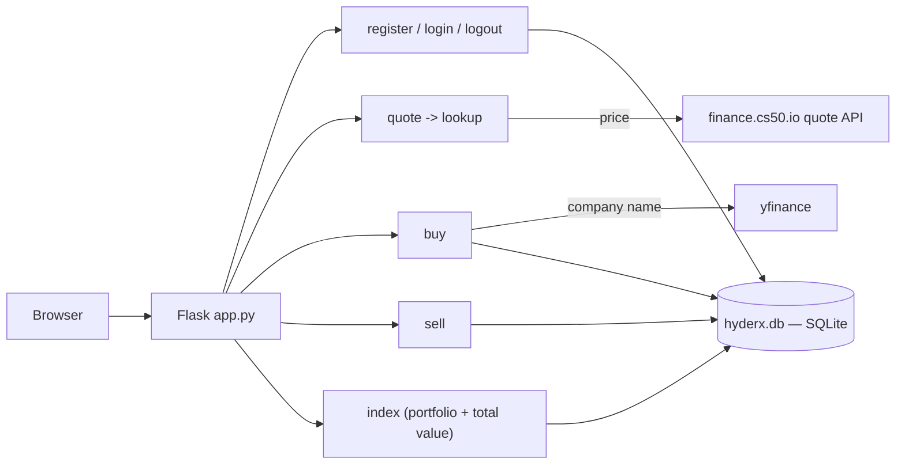

# HyderX Stock Exchange

> A **Flask + SQLite** stock-trading simulator — register, get live quotes, buy and sell shares against a virtual balance, and track your portfolio's value in real time.


Every new user starts with **$10,000** of virtual cash. You look up a stock by symbol, buy shares (cash is debited), sell them back (cash is credited), and the home page values your holdings at live prices so you can see your total worth move.

---

## Features

- 👤 **Accounts** — register with username, email and password (hashed with Werkzeug); log in / out
- 💹 **Live quotes** — look up the current price of any symbol
- 🛒 **Buy** shares against your cash balance
- 💰 **Sell** shares back, with validation against what you actually own
- 📊 **Portfolio** — holdings priced at live quotes, plus cash and total value
- 🧾 **Transactions** — every buy/sell is recorded in the database

---

## How It Works



Prices are fetched through `helpers.lookup()` (CS50's `finance.cs50.io` quote API); the company name shown on a buy comes from `yfinance`.

---

## Tech Stack

| Purpose | Tools |
|---------|-------|
| Web | Flask, Flask-Session (filesystem sessions), Jinja2 |
| Database | SQLite via the `cs50` SQL library |
| Auth | Werkzeug password hashing |
| Market data | `requests` → finance.cs50.io, `yfinance` |

---

## Getting Started

```bash
python -m venv .venv && source .venv/bin/activate    # Windows: .venv\Scripts\activate
pip install -r requirements.txt

# create the database from the schema
sqlite3 hyderx.db < hyderx.sql

flask run
```
Then open the URL Flask prints, register an account, and start trading.

---

## Database Schema (`hyderx.sql`)

| Table | Purpose |
|-------|---------|
| `users` | accounts: username, email, password hash, cash balance (default 10000) |
| `portfolio` | current holdings per user (symbol, shares, price) |
| `transactions` | full buy/sell history |
| `stocks` | last-seen price and company name per symbol |
| `admins`, `discounts` | scaffolding for an admin/discounts extension |

---

## Project Structure

```
app.py          Flask routes: register, login, quote, buy, sell, index, history
helpers.py      lookup() price fetch, usd() filter, login_required, error()
hyderx.sql      database schema (run this to create hyderx.db)
templates/      Jinja2 pages (layout, login, register, quote, buy, sell, index, ...)
static/         styles.css, favicon
```

---

## Notes & Acknowledgements

- The **history** page is currently a stub (it redirects home); transactions are still recorded in the database.
- This project is built on the structure of **Harvard CS50's *Finance* problem set**. The `helpers.py` scaffolding, the base templates, the `cs50` library and the `finance.cs50.io` quote API are from CS50; the custom schema (`hyderx.sql` with `admins`/`discounts`/`stocks`), email registration, and the `yfinance` integration are my additions. The code I wrote is under the MIT License (see `LICENSE`); CS50's distribution code remains under its own terms.

---

## Author

**Muhammad Wajih Hyder** — BS Computer Science, FAST‑NUCES (2026)
[GitHub @wajihhyder](https://github.com/wajihhyder) · wajihhyder22@gmail.com
